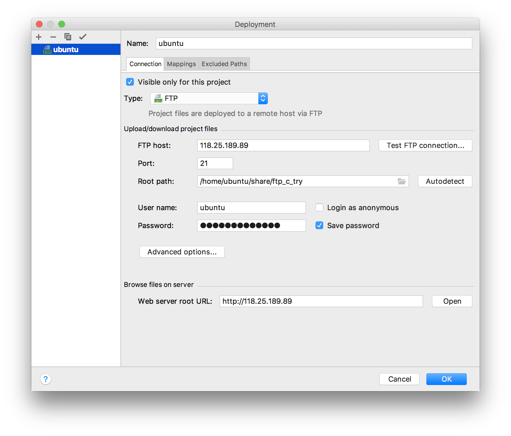
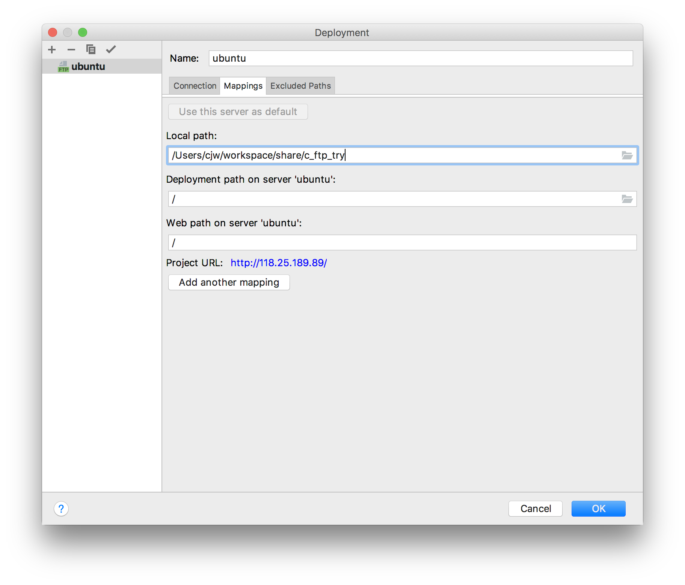

 # Mac Clion ftp远程调试配置

1. 在 Linux 上安装配置 vsftpd

2. Append `vsftpd.conf` 以打开550端口

   ```config
   write_enable=YES
   ```

3. Clion建立一个新工程，打开Tool->Configuration->Deployment

   

   * 建立新的配置，host为服务器ip（注意是公网还是私网ip）

   * root path 填服务器端的对应工程的目录
   * 点击 Test FTP connection

4. 点击mapping选项卡进行设置

   

   local path填写本地此项目的目录

5. 点击Tool->Configuration->upload XXX上传代码

6. 可设置自动同步